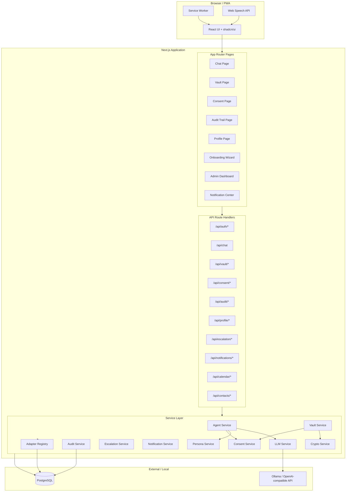
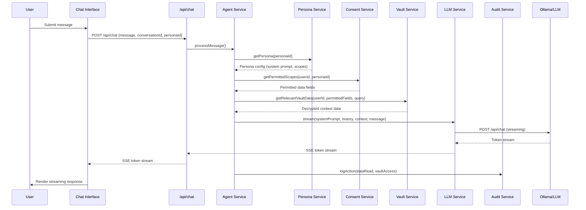
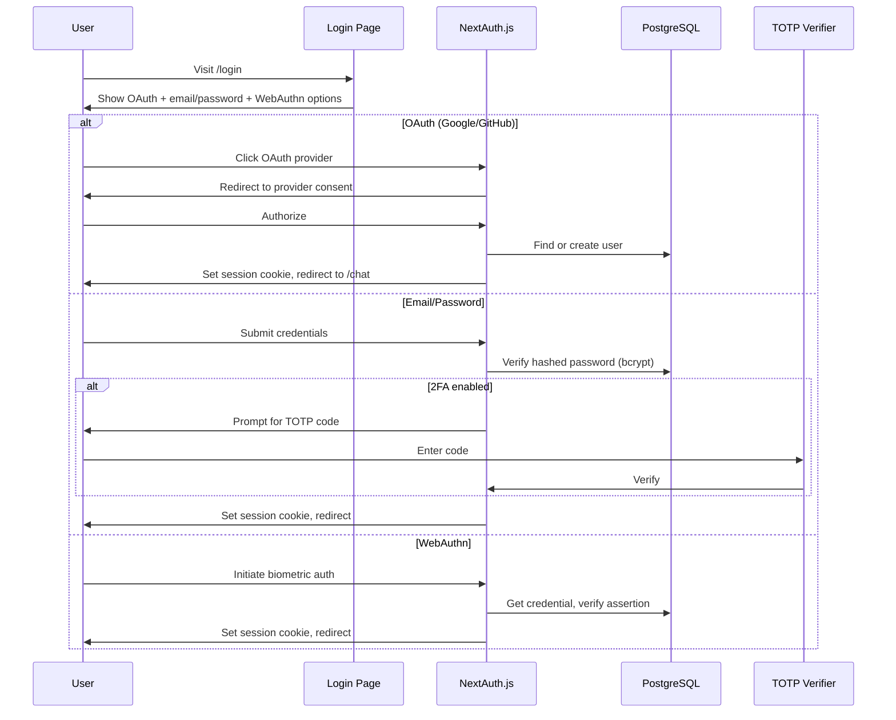
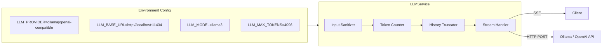

# Design Document — Hushh Personal Data Agent

## Overview

The Hushh Personal Data Agent is a privacy-first, full-stack Next.js 14+ Progressive Web App that provides two AI personas (Kai and Nav) as personal digital concierges. The system is built entirely with free and open-source tools and runs locally or in Docker.

The architecture follows a layered approach:
- **Presentation Layer**: Next.js App Router pages + React components + shadcn/ui
- **API Layer**: Next.js Route Handlers (REST) with NextAuth.js session middleware
- **Service Layer**: Domain services (Agent, Vault, Consent, Audit, Notification, Adapter)
- **Data Layer**: PostgreSQL via Prisma ORM with AES-256 encryption at rest for Vault entries
- **AI Layer**: LangChain.js orchestrating Ollama (local) or any OpenAI-compatible endpoint

Key design decisions:
1. **Server-side encryption**: Vault data is encrypted/decrypted in the API layer, never exposing keys to the client.
2. **Consent-gated data access**: Every Vault read passes through the Consent Manager, which checks per-field toggles before decryption.
3. **Append-only audit log with hash chain**: Tamper-evident logging using SHA-256 chaining.
4. **Adapter pattern for integrations**: All external data sources implement a standard interface; the Mock Data layer is the default adapter.
5. **Streaming chat via Server-Sent Events**: LLM responses stream token-by-token to the client.

## Architecture

### System Architecture Diagram



### Request Flow: Chat Message



## Components and Interfaces

### Project Structure

```
hushh-personal-agent/
├── prisma/
│   ├── schema.prisma
│   ├── seed.ts                    # Mock data seeder
│   └── migrations/
├── public/
│   ├── manifest.json              # PWA manifest
│   ├── sw.js                      # Service worker
│   └── icons/                     # PWA icons
├── src/
│   ├── app/
│   │   ├── layout.tsx             # Root layout (theme provider, session)
│   │   ├── page.tsx               # Landing / redirect
│   │   ├── (auth)/
│   │   │   ├── login/page.tsx
│   │   │   └── register/page.tsx
│   │   ├── (main)/
│   │   │   ├── layout.tsx         # Authenticated layout (sidebar, header)
│   │   │   ├── chat/
│   │   │   │   └── [conversationId]/page.tsx
│   │   │   ├── vault/page.tsx
│   │   │   ├── consent/page.tsx
│   │   │   ├── audit/page.tsx
│   │   │   ├── profile/page.tsx
│   │   │   ├── notifications/page.tsx
│   │   │   └── calendar/page.tsx
│   │   ├── onboarding/page.tsx
│   │   ├── admin/
│   │   │   └── escalations/page.tsx
│   │   └── api/
│   │       ├── auth/[...nextauth]/route.ts
│   │       ├── chat/route.ts
│   │       ├── vault/route.ts
│   │       ├── vault/[entryId]/route.ts
│   │       ├── consent/route.ts
│   │       ├── audit/route.ts
│   │       ├── profile/route.ts
│   │       ├── notifications/route.ts
│   │       ├── calendar/route.ts
│   │       ├── contacts/route.ts
│   │       └── escalation/route.ts
│   ├── components/
│   │   ├── ui/                    # shadcn/ui primitives
│   │   ├── chat/
│   │   │   ├── ChatWindow.tsx
│   │   │   ├── MessageBubble.tsx
│   │   │   ├── MessageInput.tsx
│   │   │   ├── VoiceButton.tsx
│   │   │   ├── PersonaSelector.tsx
│   │   │   ├── TypingIndicator.tsx
│   │   │   └── ConversationSidebar.tsx
│   │   ├── vault/
│   │   │   ├── VaultEntryList.tsx
│   │   │   └── VaultEntryForm.tsx
│   │   ├── consent/
│   │   │   ├── ConsentToggle.tsx
│   │   │   └── ConsentHistory.tsx
│   │   ├── onboarding/
│   │   │   ├── OnboardingWizard.tsx
│   │   │   ├── PersonaIntroStep.tsx
│   │   │   ├── PreferencesStep.tsx
│   │   │   └── ConsentStep.tsx
│   │   ├── notifications/
│   │   │   ├── NotificationCenter.tsx
│   │   │   └── NotificationBadge.tsx
│   │   ├── layout/
│   │   │   ├── AppHeader.tsx
│   │   │   ├── AppSidebar.tsx
│   │   │   └── ThemeToggle.tsx
│   │   └── shared/
│   │       ├── SkeletonLoader.tsx
│   │       └── ErrorBoundary.tsx
│   ├── lib/
│   │   ├── auth.ts                # NextAuth config
│   │   ├── prisma.ts              # Prisma client singleton
│   │   ├── crypto.ts              # AES-256 encrypt/decrypt
│   │   ├── audit.ts               # Hash chain audit logging
│   │   ├── llm.ts                 # LangChain + Ollama/OpenAI client
│   │   ├── personas.ts            # Persona definitions (Kai, Nav)
│   │   ├── consent.ts             # Consent checking logic
│   │   ├── vault.ts               # Vault CRUD with encryption
│   │   ├── vault-schema.ts        # JSON schema definitions + validation
│   │   ├── vault-serializer.ts    # Parse/serialize/pretty-print Vault entries
│   │   ├── notifications.ts       # Notification generation + delivery
│   │   └── adapters/
│   │       ├── interface.ts       # Adapter interface definition
│   │       ├── registry.ts        # Adapter registry
│   │       └── mock-adapter.ts    # Mock data adapter
│   ├── hooks/
│   │   ├── useChat.ts
│   │   ├── useVoice.ts
│   │   ├── useTheme.ts
│   │   └── useNotifications.ts
│   └── types/
│       ├── index.ts               # Shared TypeScript types
│       ├── vault.ts               # Vault entry types
│       ├── persona.ts             # Persona types
│       └── adapter.ts             # Adapter types
├── docker-compose.yml
├── .env.example
├── next.config.js
├── tailwind.config.ts
├── tsconfig.json
└── package.json
```


### Key Interfaces

#### Adapter Interface (`src/lib/adapters/interface.ts`)

```typescript
export interface AdapterConfig {
  id: string;
  name: string;
  enabled: boolean;
  credentials?: Record<string, string>;
}

export interface AdapterResult<T> {
  success: boolean;
  data?: T;
  error?: { code: string; message: string };
}

export interface DataAdapter {
  readonly id: string;
  readonly name: string;

  initialize(config: AdapterConfig): Promise<void>;
  authenticate(): Promise<AdapterResult<void>>;
  fetchData<T>(query: DataQuery): Promise<AdapterResult<T[]>>;
  transformData<TInput, TOutput>(raw: TInput): AdapterResult<TOutput>;
  healthCheck(): Promise<AdapterResult<{ status: "ok" | "degraded" | "down" }>>;
}

export interface DataQuery {
  entityType: VaultEntryType;
  filters?: Record<string, unknown>;
  limit?: number;
  offset?: number;
}
```

#### Vault Service Interface (`src/lib/vault.ts`)

```typescript
export interface VaultService {
  create(userId: string, entry: CreateVaultEntryInput): Promise<VaultEntry>;
  read(userId: string, entryId: string, personaId?: string): Promise<VaultEntry>;
  update(userId: string, entryId: string, data: UpdateVaultEntryInput): Promise<VaultEntry>;
  delete(userId: string, entryId: string): Promise<void>;
  query(userId: string, query: VaultQuery, personaId?: string): Promise<VaultEntry[]>;
}
```

#### Consent Service Interface (`src/lib/consent.ts`)

```typescript
export interface ConsentService {
  getToggles(userId: string): Promise<ConsentToggle[]>;
  setToggle(userId: string, fieldId: string, enabled: boolean, personaScope: PersonaScope): Promise<void>;
  checkAccess(userId: string, fieldId: string, personaId: string): Promise<boolean>;
  getPermittedFields(userId: string, personaId: string): Promise<string[]>;
  getHistory(userId: string, pagination: PaginationParams): Promise<ConsentHistoryEntry[]>;
}

export type PersonaScope = "kai" | "nav" | "both";
```

#### Audit Service Interface (`src/lib/audit.ts`)

```typescript
export interface AuditService {
  log(entry: CreateAuditEntry): Promise<AuditEntry>;
  getEntries(userId: string, filters: AuditFilters, pagination: PaginationParams): Promise<PaginatedResult<AuditEntry>>;
  verifyChain(userId: string): Promise<{ valid: boolean; brokenAt?: string }>;
}

export interface CreateAuditEntry {
  userId: string;
  actionType: AuditActionType;
  resource: string;
  resourceId?: string;
  personaId?: string;
  metadata?: Record<string, unknown>;
}

export type AuditActionType =
  | "data_read" | "data_write" | "data_delete"
  | "consent_grant" | "consent_revoke"
  | "auth_login" | "auth_logout" | "auth_failed"
  | "escalation_created" | "escalation_resolved"
  | "notification_sent";
```

#### LLM Service Interface (`src/lib/llm.ts`)

```typescript
export interface LLMService {
  stream(params: LLMStreamParams): AsyncGenerator<string, void, unknown>;
  estimateTokens(text: string): number;
  truncateHistory(messages: ChatMessage[], maxTokens: number, systemPrompt: string): ChatMessage[];
  sanitizeInput(input: string): string;
}

export interface LLMStreamParams {
  systemPrompt: string;
  history: ChatMessage[];
  contextData: string;
  userMessage: string;
  maxTokens?: number;
}
```

#### Persona Configuration (`src/lib/personas.ts`)

```typescript
export interface PersonaConfig {
  id: string;
  name: string;
  avatar: string;
  systemPrompt: string;
  behavioralRules: string[];
  allowedDataScopes: string[];  // Vault entry types this persona can access
  description: string;
}

// Kai: financial advisor persona
// Nav: lifestyle/brand/creator persona
export const PERSONAS: Record<string, PersonaConfig> = { kai: {...}, nav: {...} };
```

#### Notification Service Interface (`src/lib/notifications.ts`)

```typescript
export interface NotificationService {
  create(params: CreateNotificationParams): Promise<Notification>;
  getAll(userId: string, filters?: NotificationFilters): Promise<Notification[]>;
  markAsRead(userId: string, notificationId: string): Promise<void>;
  getUnreadCount(userId: string): Promise<number>;
  checkAndGenerateAlerts(userId: string): Promise<void>;
}

export type NotificationType =
  | "financial_alert" | "contact_reminder"
  | "calendar_reminder" | "system_notification";
```

#### Vault Serializer Interface (`src/lib/vault-serializer.ts`)

```typescript
export interface VaultSerializer {
  parse(json: string): VaultEntry;
  serialize(entry: VaultEntry): string;
  prettyPrint(entry: VaultEntry): string;
  validate(json: string, schema: VaultEntryType): ValidationResult;
}

export interface ValidationResult {
  valid: boolean;
  errors?: { field: string; message: string }[];
}
```

### API Routes

| Method | Route | Description | Auth |
|--------|-------|-------------|------|
| POST | `/api/auth/[...nextauth]` | NextAuth.js handler (OAuth, credentials, WebAuthn) | Public |
| POST | `/api/chat` | Send message, returns SSE stream | User |
| GET | `/api/chat/conversations` | List user conversations | User |
| GET | `/api/chat/conversations/[id]` | Get conversation with messages | User |
| DELETE | `/api/chat/conversations/[id]` | Delete conversation | User |
| PATCH | `/api/chat/conversations/[id]` | Rename conversation | User |
| GET | `/api/vault` | List vault entries (filtered by consent) | User |
| POST | `/api/vault` | Create vault entry | User |
| GET | `/api/vault/[entryId]` | Get single vault entry | User |
| PUT | `/api/vault/[entryId]` | Update vault entry | User |
| DELETE | `/api/vault/[entryId]` | Delete vault entry | User |
| GET | `/api/consent` | Get all consent toggles | User |
| PUT | `/api/consent` | Update consent toggle | User |
| GET | `/api/consent/history` | Get consent change history | User |
| GET | `/api/audit` | Get audit trail (paginated, filterable) | User |
| GET | `/api/profile` | Get user profile + preferences | User |
| PUT | `/api/profile` | Update profile/preferences | User |
| GET | `/api/notifications` | Get notifications | User |
| PATCH | `/api/notifications/[id]` | Mark notification as read | User |
| PUT | `/api/notifications/preferences` | Update notification preferences | User |
| GET | `/api/calendar` | Get calendar events | User |
| POST | `/api/calendar` | Create calendar event | User |
| PUT | `/api/calendar/[id]` | Update calendar event | User |
| DELETE | `/api/calendar/[id]` | Delete calendar event | User |
| GET | `/api/contacts` | List contacts | User |
| POST | `/api/contacts` | Create contact | User |
| PUT | `/api/contacts/[id]` | Update contact | User |
| DELETE | `/api/contacts/[id]` | Delete contact | User |
| GET | `/api/contacts/search` | Search contacts | User |
| POST | `/api/escalation` | Create escalation | User |
| GET | `/api/escalation` | List escalations (admin) | Admin |
| PATCH | `/api/escalation/[id]` | Resolve escalation (admin) | Admin |

### Authentication Flow




### Encryption Architecture

The Crypto Service (`src/lib/crypto.ts`) handles all Vault encryption:

- **Algorithm**: AES-256-GCM (authenticated encryption)
- **Key derivation**: A per-user encryption key is derived from a master key + user ID using HKDF (HMAC-based Key Derivation Function)
- **Master key**: Stored as `VAULT_MASTER_KEY` environment variable (32 bytes, hex-encoded)
- **IV**: A unique 12-byte random IV is generated per encryption operation and stored alongside the ciphertext
- **Storage format**: `{iv}:{authTag}:{ciphertext}` (all base64-encoded)

```typescript
// src/lib/crypto.ts
export function deriveUserKey(masterKey: Buffer, userId: string): Buffer;
export function encrypt(plaintext: string, userKey: Buffer): string;
export function decrypt(encrypted: string, userKey: Buffer): string;
```

### Audit Hash Chain

Each audit entry includes a SHA-256 hash of the previous entry, forming a tamper-evident chain:

```typescript
// Hash computation for entry N
hash_N = SHA256(JSON.stringify({
  previousHash: hash_N-1,
  timestamp: entry.timestamp,
  userId: entry.userId,
  actionType: entry.actionType,
  resource: entry.resource,
  resourceId: entry.resourceId
}))
```

The first entry in a user's chain uses `"GENESIS"` as the previous hash.

### LLM Integration Architecture



The LLM Service uses LangChain.js `ChatOllama` or `ChatOpenAI` depending on the `LLM_PROVIDER` env var. Streaming is handled via LangChain's `.stream()` method, which yields tokens that are forwarded as Server-Sent Events to the client.

**Input sanitization** strips potential prompt injection patterns:
- Removes system prompt override attempts (`You are now...`, `Ignore previous instructions...`)
- Escapes special delimiters that could break prompt structure
- Logs sanitization events to the audit trail

**Context window management**:
1. System prompt is always preserved (highest priority)
2. User's latest message is always included
3. Relevant Vault context is included next
4. Conversation history is truncated from oldest messages when approaching the token limit

## Data Models

### Prisma Schema

```prisma
generator client {
  provider = "prisma-client-js"
}

datasource db {
  provider = "postgresql"
  url      = env("DATABASE_URL")
}

model User {
  id                String    @id @default(cuid())
  email             String    @unique
  name              String?
  passwordHash      String?
  avatar            String?
  timezone          String    @default("UTC")
  preferredLanguage String    @default("en")
  onboardingDone    Boolean   @default(false)
  twoFactorEnabled  Boolean   @default(false)
  twoFactorSecret   String?
  failedTotpAttempts Int      @default(0)
  totpLockedUntil   DateTime?
  createdAt         DateTime  @default(now())
  updatedAt         DateTime  @updatedAt

  accounts       Account[]
  sessions       Session[]
  webauthnCreds  WebAuthnCredential[]
  conversations  Conversation[]
  vaultEntries   VaultEntry[]
  consentToggles ConsentToggle[]
  auditEntries   AuditEntry[]
  notifications  Notification[]
  escalations    Escalation[]
  profile        UserProfile?

  @@map("users")
}

model Account {
  id                String  @id @default(cuid())
  userId            String
  type              String
  provider          String
  providerAccountId String
  refresh_token     String?
  access_token      String?
  expires_at        Int?
  token_type        String?
  scope             String?
  id_token          String?

  user User @relation(fields: [userId], references: [id], onDelete: Cascade)

  @@unique([provider, providerAccountId])
  @@map("accounts")
}

model Session {
  id           String   @id @default(cuid())
  sessionToken String   @unique
  userId       String
  expires      DateTime

  user User @relation(fields: [userId], references: [id], onDelete: Cascade)

  @@map("sessions")
}

model WebAuthnCredential {
  id              String   @id @default(cuid())
  userId          String
  credentialId    String   @unique
  publicKey       String
  counter         Int      @default(0)
  transports      String[] @default([])
  createdAt       DateTime @default(now())

  user User @relation(fields: [userId], references: [id], onDelete: Cascade)

  @@map("webauthn_credentials")
}

model Conversation {
  id        String   @id @default(cuid())
  userId    String
  personaId String
  title     String
  createdAt DateTime @default(now())
  updatedAt DateTime @updatedAt

  user     User      @relation(fields: [userId], references: [id], onDelete: Cascade)
  messages Message[]

  @@index([userId, personaId])
  @@map("conversations")
}

model Message {
  id             String   @id @default(cuid())
  conversationId String
  role           String   // "user" | "assistant"
  content        String
  createdAt      DateTime @default(now())

  conversation Conversation @relation(fields: [conversationId], references: [id], onDelete: Cascade)

  @@index([conversationId])
  @@map("messages")
}

model VaultEntry {
  id            String   @id @default(cuid())
  userId        String
  entryType     String   // "financial_record" | "contact" | "calendar_event" | "preference" | "booking" | "escalation"
  encryptedData String   // AES-256-GCM encrypted JSON: "{iv}:{authTag}:{ciphertext}"
  createdAt     DateTime @default(now())
  updatedAt     DateTime @updatedAt

  user User @relation(fields: [userId], references: [id], onDelete: Cascade)

  @@index([userId, entryType])
  @@map("vault_entries")
}

model ConsentToggle {
  id           String   @id @default(cuid())
  userId       String
  dataFieldId  String   // e.g. "financial_records", "contacts", "calendar", "wellness", "preferences"
  enabled      Boolean  @default(false)
  personaScope String   @default("both") // "kai" | "nav" | "both"
  updatedAt    DateTime @updatedAt

  user User @relation(fields: [userId], references: [id], onDelete: Cascade)

  @@unique([userId, dataFieldId, personaScope])
  @@map("consent_toggles")
}

model AuditEntry {
  id           String   @id @default(cuid())
  userId       String
  actionType   String
  resource     String
  resourceId   String?
  personaId    String?
  metadata     Json?
  hash         String   // SHA-256 hash for chain integrity
  previousHash String   // Hash of previous entry (or "GENESIS")
  createdAt    DateTime @default(now())

  user User @relation(fields: [userId], references: [id], onDelete: Cascade)

  @@index([userId, actionType])
  @@index([userId, createdAt])
  @@map("audit_entries")
}

model Notification {
  id               String   @id @default(cuid())
  userId           String
  type             String   // "financial_alert" | "contact_reminder" | "calendar_reminder" | "system_notification"
  title            String
  body             String
  read             Boolean  @default(false)
  linkedResource   String?  // e.g. "conversation:abc123" or "vault:xyz789"
  createdAt        DateTime @default(now())

  user User @relation(fields: [userId], references: [id], onDelete: Cascade)

  @@index([userId, read])
  @@map("notifications")
}

model NotificationPreference {
  id               String  @id @default(cuid())
  userId           String
  notificationType String
  enabled          Boolean @default(true)
  pushEnabled      Boolean @default(false)

  @@unique([userId, notificationType])
  @@map("notification_preferences")
}

model Escalation {
  id                String   @id @default(cuid())
  userId            String
  personaId         String
  originalQuery     String
  preliminaryResponse String?
  escalationReason  String
  status            String   @default("pending") // "pending" | "in_review" | "resolved"
  resolution        String?
  resolvedBy        String?
  createdAt         DateTime @default(now())
  updatedAt         DateTime @updatedAt

  user User @relation(fields: [userId], references: [id], onDelete: Cascade)

  @@index([status])
  @@map("escalations")
}

model UserProfile {
  id                    String  @id @default(cuid())
  userId                String  @unique
  riskTolerance         String? // "conservative" | "moderate" | "aggressive"
  investmentGoals       String?
  incomeRange           String?
  wellnessInterests     String[] @default([])
  dietaryPreferences    String[] @default([])
  favoriteCategories    String[] @default([])

  user User @relation(fields: [userId], references: [id], onDelete: Cascade)

  @@map("user_profiles")
}
```

### Vault Entry Schemas (JSON)

Each `VaultEntry.encryptedData` field, once decrypted, conforms to one of these schemas:

**Financial Record**
```json
{
  "type": "financial_record",
  "subtype": "transaction | holding | budget",
  "data": {
    "description": "string",
    "amount": "number",
    "currency": "string",
    "category": "string",
    "date": "ISO8601 string",
    "account": "string",
    "metadata": {}
  }
}
```

**Contact**
```json
{
  "type": "contact",
  "data": {
    "name": "string",
    "email": "string?",
    "phone": "string?",
    "relationshipType": "personal | professional | family",
    "importantDates": [{ "label": "string", "date": "ISO8601 string" }],
    "notes": "string?",
    "tags": ["string"],
    "communicationHistory": [{ "date": "ISO8601 string", "summary": "string" }]
  }
}
```

**Calendar Event**
```json
{
  "type": "calendar_event",
  "data": {
    "title": "string",
    "description": "string?",
    "startTime": "ISO8601 string",
    "endTime": "ISO8601 string",
    "location": "string?",
    "recurrence": "none | daily | weekly | monthly | yearly"
  }
}
```

**Preference**
```json
{
  "type": "preference",
  "data": {
    "category": "financial | lifestyle | notification",
    "key": "string",
    "value": "any"
  }
}
```

**Booking**
```json
{
  "type": "booking",
  "data": {
    "serviceType": "restaurant | appointment | service",
    "venue": "string",
    "date": "ISO8601 string",
    "time": "string",
    "preferences": "string?",
    "status": "pending | confirmed | cancelled"
  }
}
```
